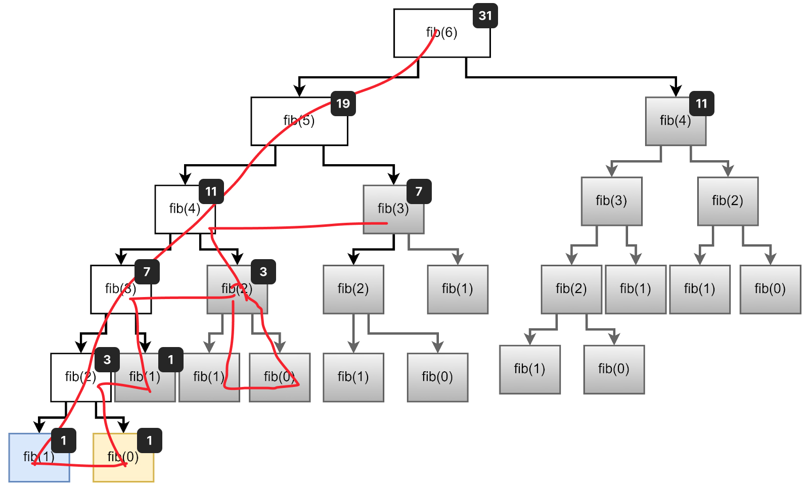
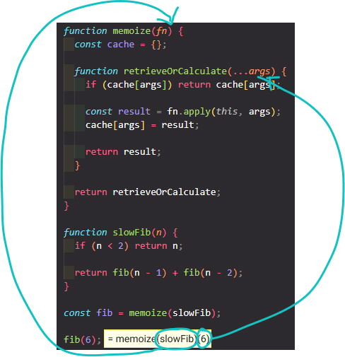
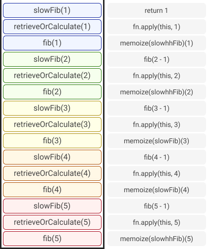

# The Coding Interview Bootcamp: Algorithms + Data Structures

Ace your next Javascript coding interview by mastering data structures and algorithms.

- Creator: Stephen Grider
- Platform: Udemy
- [Course Link](https://www.udemy.com/course/coding-interview-bootcamp-algorithms-and-data-structure/)

## Usage

```bash
jest 'folder-name'/test.js --watch
```

## Tips

### 1. String Reversal

- `Array.reverse()`
- `for...of`
- `Array.reduce()`
- `Array.unshift()`

> 💡 되도록 for loop 대신 for-of or for-in loop를 사용하자

> 📝 string ↔ array: `String.split("separator")` ↔ `Array.join("separator")`

### 2. Palindromes

- `Array.reverse()`
- `Array.every()`⭐

### 3. Integer Reversal

- `Math.sign()`⭐

> 💡 `parseInt()` 와 `+`는 결과가 다를 수 있다
>
> ```ts
> parseInt('02-') // 2
> +('02-') // NaN
>```

### 4. Max Chars

- `buildCharMap()`

### 5. FizzBuzz

- `for(;;)`

### 6. Array Chunking

- `Array.slice()`
- without `Array.slice()`

### 7. Anagrams

- `buildCharMap()`
- `Array.sort()`

> 🚨 `Array.foreach()`을 중간에 멈추는 방법은 throw exception뿐
> There is no way to stop or break a forEach() loop other than by throwing an exception. If you need such behavior, the forEach() method is the wrong tool.
> Early termination may be accomplished with:
>
> - A simple loop
> - A `for...of` loop

> 💡 Regular Expressions(<https://www.datacamp.com/cheat-sheet/regular-expresso>)
>
> - `^`: match start of line
>   - ex) `^r` ▶ ==r==abbit / ==r==accoon
> - `\w`: match word characters
>   - ex) `\wee\w` ▶ t==rees== / ==bee4==

### 8. Sentence Capitalization

- `String.slice()`
- `for(;;)`

### 9. Printing Steps

| Solutions  |  Big O |
|---|---|
| table | O(n^2) |
| Recursions | O(n^2) |
| `Array.push()` + `Array.join()`| O(n) |

> 💡 recursion 문제 tip
>
> - pseudo code solution을 작성하며 연습하기
> - base case를 먼저 생각하기(recursion이 멈추는 조건)
> - 셀프호출 시 return 하지 않으면 무한 loop
>
### 10. Two Sided Steps - Pyramids

| Solutions  |  Big O |
|---|---|
| table | O(n^2) |
| recursion | O(n^2) |
| concatenating| O(n^2) |

### 11. Find The Vowels

| Solutions  |  Big O |
|---|---|
| `Array.includes()` | O(n) |
| `buildCharMap()` | O(n) |
| `String.match()` | O(n) |

- string보다 array 사용(string은 multiple character 체크 불가)

> 💡 Regular Expressions
>
> - `[]`: match several characters
>   - ex) `gr[ea]y` ▶ ==gray== / ==grey==

> 📝 `String.prototype.match()`
> : The match() method retrieves the result of matching a string against a regular expression.>
>
>    ```ts
>    match(regexp: RegExp): RegExpMatchArray | null;
>    ```

### 12. Enter the Matrix Spiral

| Solutions  |  Big O |
|---|---|
| spiral row + col | O(n^2) |

### 13. Fibonacci

| Solutions  |  Big O |
|---|---|
| Dynamic Programming | O(n) |
| Recursions | O(n^2) |
| Recursions with memoization 1 | O(n) |
| Recursions with memoization 2 | O(n) |
| Generators | O(n) |

> 📝 Dynamic Programming
> : a technique used in computer science to solve problems by breaking them down into smaller, simpler subproblems, and solving each subproblem only once. The solutions to the subproblems are then stored in memory so that they can be reused when necessary, avoiding redundant computations and improving efficiency.
>
- Recursions



- Recursion with memoization 1




- update values by destructuring assignment with arrays

```js
[x, y] = [y, x + y]; 
⏸
const newX = y
const newY = x + y
x = newX
y = newY
```

### 14. Weaving two queues

| Solutions  |  Big O | |
|---|---|---|
| `while`| O(n) | n: the total number of elements in both sourceOne and sourceTwo|

- Queue 구현(둘다 맞으나 ➡이 보편적인 듯?)
  - insert 방향 ➡ : `unshift()` and `pop()`
  - insert 방향 ⬅ : `push()` and `shift()`

### 15. Queue from Stack
