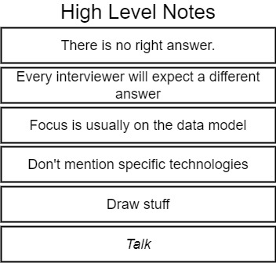
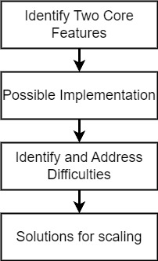

# The Coding Interview Bootcamp: Algorithms + Data Structures

Ace your next Javascript coding interview by mastering data structures and algorithms.


- Creator: Stephen Grider
- Platform: Udemy
- [Course Link](https://www.udemy.com/course/coding-interview-bootcamp-algorithms-and-data-structure/)

## Usage

```bash
jest 'folder-name'/test.js --watch
```

## Tips

### 1. String Reversal

- `Array.reverse()`
- `for...of`
- `Array.reduce()`
- `Array.unshift()`

> 💡 되도록 for loop 대신 for-of or for-in loop를 사용하자

> 📝 string ↔ array: `String.split("separator")` ↔ `Array.join("separator")`

### 2. Palindromes

- `Array.reverse()`
- `Array.every()`⭐

### 3. Integer Reversal

- `Math.sign()`⭐

> 💡 `parseInt()` 와 `+`는 결과가 다를 수 있다
>
> ```ts
> parseInt('02-') // 2
> +('02-') // NaN
>```

### 4. Max Chars

- `buildCharMap()`

### 5. FizzBuzz

- `for(;;)`

### 6. Array Chunking

- `Array.slice()`
- without `Array.slice()`

### 7. Anagrams

- `buildCharMap()`
- `Array.sort()`

> 🚨 `Array.foreach()`을 중간에 멈추는 방법은 throw exception뿐
> There is no way to stop or break a forEach() loop other than by throwing an exception. If you need such behavior, the forEach() method is the wrong tool.
> Early termination may be accomplished with:
>
> - A simple loop
> - A `for...of` loop

> 💡 Regular Expressions(<https://www.datacamp.com/cheat-sheet/regular-expresso>)
>
> - `^`: match start of line
>   - ex) `^r` ▶ ==r==abbit / ==r==accoon
> - `\w`: match word characters
>   - ex) `\wee\w` ▶ t==rees== / ==bee4==

### 8. Sentence Capitalization

- `String.slice()`
- `for(;;)`

### 9. Printing Steps

| Solutions  |  Big O |
|---|---|
| table | O(n^2) |
| Recursions | O(n^2) |
| `Array.push()` + `Array.join()`| O(n) |

> 💡 recursion 문제 tip
>
> - pseudo code solution을 작성하며 연습하기
> - base case를 먼저 생각하기(recursion이 멈추는 조건)
> - 셀프호출 시 return 하지 않으면 무한 loop
>
### 10. Two Sided Steps - Pyramids

| Solutions  |  Big O |
|---|---|
| table | O(n^2) |
| recursion | O(n^2) |
| concatenating| O(n^2) |

### 11. Find The Vowels

| Solutions  |  Big O |
|---|---|
| `Array.includes()` | O(n) |
| `buildCharMap()` | O(n) |
| `String.match()` | O(n) |

- string보다 array 사용(string은 multiple character 체크 불가)

> 💡 Regular Expressions
>
> - `[]`: match several characters
>   - ex) `gr[ea]y` ▶ ==gray== / ==grey==

> 📝 `String.prototype.match()`
> : The match() method retrieves the result of matching a string against a regular expression.>
>
>    ```ts
>    match(regexp: RegExp): RegExpMatchArray | null;
>    ```

### 12. Enter the Matrix Spiral

| Solutions  |  Big O |
|---|---|
| spiral row + col | O(n^2) |

### 13. Fibonacci

| Solutions  |  Big O |
|---|---|
| Dynamic Programming | O(n) |
| Recursions | O(n^2) |
| Recursions with memoization 1 | O(n) |
| Recursions with memoization 2 | O(n) |
| Generators | O(n) |

> 📝 Dynamic Programming
> : a technique used in computer science to solve problems by breaking them down into smaller, simpler subproblems, and solving each subproblem only once. The solutions to the subproblems are then stored in memory so that they can be reused when necessary, avoiding redundant computations and improving efficiency.
>
- Recursions


- Recursion with memoization 1


- update values by destructuring assignment with arrays

```js
[x, y] = [y, x + y]; 
⏸
const newX = y
const newY = x + y
x = newX
y = newY
```

### 14. Weaving two queues

| Solutions  |  Big O | |
|---|---|---|
| `while`| O(n) | n: the total number of elements in both sourceOne and sourceTwo|

- Queue 구현(둘다 맞으나 ➡이 보편적인 듯?)
  - insert 방향 ➡ : `Array.unshift()` and `Array.pop()`
  - insert 방향 ⬅ : `Array.push()` and `Array.shift()`

#### Queue

| Solutions  |  Big O
|---|---|
| `add`| `Array.unshift()`: O(n), `Array.push()`: O(1) |
| `remove`|`Array.pop()`: O(1), `Array.shift()`: O(n) |
| `peek`| O(1) |

### 15. Queue from Stack

| Solutions  |  Big O
|---|---|
| `add`| O(1) |
| `remove`| O(n) |
| `peek`| O(n) |

#### Stack

| Solutions  |  Big O
|---|---|
| `push`| O(1) |
| `pop`| O(1) |
| `peek`| O(1) |

### 16. Linked List

- index = 0 : `this.head`

> 💡 `null` vs `undefined`
>
> - index에 해당하는 node가 없을 경우 return 값
>   - `LinkedList.getAt(index)`: `null` (값을 요청함 👉 값이 없다)
>   - `LinkedList.removeAt(index)`: `undefined` (액션을 요청함 👉 아무 것도 하지 않았다)

### 17. Find the Midpoint

### 18. Circular Lists

### 19. Step Back From the Tail

### 20. Tree

- node를 추가/삭제하는 method를 data structure에  적용하는 것이 아니라 그 안에 node에 적용함
  - linked list와 달리  node를 추가/삭제할 때 어떤 node에 적용해야하는지 정해줘야 하기 때문

- `traverseBF(fn)`: parent node를 children node로 치환하여 뒤에 붙이고 parent node를 처리하는 방식
- `traverseDF(fn)`: parent node를 children node로 치환하여 앞에 붙이고 parent node를 처리하는 방식

### 21. Tree Width with Level Width

### 22. Binary Search Trees

- search 할 때는 빠르고 CUD할 때는 오래 걸리는 것이 database의 index 기능과 비슷
- 좌우 children에 크기 제한 없으면 그냥 Binary Tree

> 🚨 `else if`를 쓰기 싫다면 `if`문 내에서 `return`해야 함

### Sorting Algorithms in the Job Interview

- number로 이루어진 array를 오른차순으로 정렬하는 것
- sorting algorithm을 직접 구현해보라고 하는 경우는 거의 없음
- 어떤 sorting algorithm에 대해 설명하거나 여러 algorithm들을 비교하여 설명하는 질문 위주

### Bubble Sort

- to find the largest element in the array and drag it over to the far right hand side
- array에서 가장 큰 수를 찾아 맨 오른쪽으로 옮기고 그 수를 제외한 array로 줄여가며 반복

### Selection Sort

- prove me wrong algorithm

### How to Build Twitter

#### 기본 원칙



##### 정답은 없다

- 진짜 Twitter를 어떻게 만드는지 정답을 기대하고 물어보는 것이 아님
  - how you communicate
  - what you're trying to say
  - exactly what areas you are focusing on

##### interviewer마다 원하는 답변이 다르다

- product의 문제점을 어떻게 찾아내는지, 어떻게 scale out해야 하는지 등
- 어디에 집중해야할 지 직접 물어보자
  - hey, this product, Twitter, has many different features involved in it. Is there some particular area that you want to me to focus on now?
  - 보통은 알아서 하라고 함

##### 구체적인 direction이 없다면 data model에서 시작하자

- tweets 또는 users을 database에 어떻게 저장할 것인지
- 그런 경험이 없다면 익숙한 분야로 이야기로 바꿔볼 수 있음. UI 등

##### 단순히 사용할 특정 framework나 technologies에 초점을 맞추지 말자

- ❌ 저는 React, Redux, Express를 사용하겠습니다.
- ✅ frontend쪽에는 tweet list를 쉽게 렌더링 할 수 있고 mobile에서도 많이 접속하므로 mobile device에도 잘 작동할 수 있는 framework가 필요할 것 같습니다.

##### 그려가며 설명하자

- diagram, UI 등

##### 대화를 나누자(제일 중요)

- interviewer는 복잡한 주제를 어떻게 이야기하는지 듣고 싶은 것
- 무슨 생각을 하는지 계속 질문하고 말하라
  - ❌ 잠깐만 생각해볼게요 -> 침묵
  - ✅ 뭐부터 이야기하는게 좋을까요?

#### 기본 전략



##### 2~3가지 feature를 고른다

- UI frame을 그려놓고 2가지 기능을 골라 설명하겠다고 한다
- tweet, user feed 등

##### 어떻게 구현할 것인지 이야기한다

- 유저가 tweet하면 frontend에서 어떻게 처리하고 backend로 넘겨서 database에 어떻게 저장할 것인지 등
- tweets table에 어떤 field들이 있어야 하는지 등

##### 구현 시 발생할 수 있는 어려움에 대해 이야기한다

- interviewer가 가장 관심있게 보는 부분
- '#topic', '@mention'등은 어떻게 추가할 것인지 등
- retweet은 어떻게 구현할 것인지 등

##### 사용자가 많아질 경우 어떻게 scaling 할 것인지 이야기한다

- Caching: expensive algorithm을 사용하는 결과물은 memory에 결과를 caching해두기
- Deployment Options: 서버를 늘려서 load balancer 사용하기
